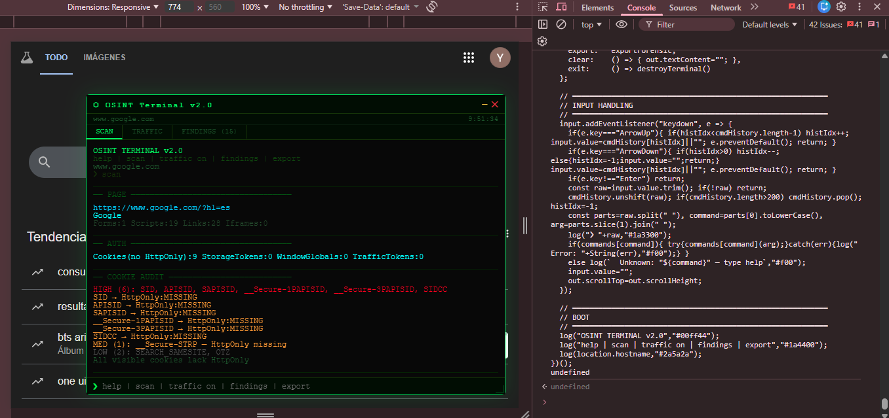

<div align="center">


<br/><br/>

```
 ⬡  O S I N T   T E R M I N A L   v 2 . 0
─────────────────────────────────────────────
  passive recon · browser · no install
```



<br/>

**A professional passive recon terminal injected directly into any webpage.**  
Drop it. Scan it. Export it.

<br/>

[](https://owasp.org/www-project-web-security-testing-guide/)
[](https://portswigger.net/bappstore/f923cbf91698420890354c1d8958fee6)
[](https://github.com/nsonaniya2010/SubDomainizer)

</div>

---

## ⚡ What is it?

**OSINT Terminal** is a single JavaScript file you inject into any webpage — via bookmarklet, browser console, or DevTools snippet — that spawns a floating terminal with passive recon capabilities aligned with OWASP WSTG standards.

No extensions. No proxy. No backend. Pure browser JS.

It intercepts `fetch`, `XMLHttpRequest`, `WebSocket`, and `postMessage` in real time, audits cookies and storage against OWASP criteria, decodes JWT tokens with JWT4B-style intelligence, extracts endpoints using LinkFinder-style analysis, identifies cloud assets like SubDomainizer, and detects secrets using TruffleHog-inspired keyword preflighting.

---

## 🖥️ Interface

The terminal renders as a **resizable, draggable floating panel** with three live tabs:

| Tab | Content |
|-----|---------|
| **SCAN** | Progressive OSINT output — auth, cookies, storage, IndexedDB, JS analysis, service workers, security headers, GraphQL ops, session persistence, diff vs last scan |
| **TRAFFIC** | Live request table — filterable by AUTH / TOKEN / COOKIE / WS / PM / ERROR. Click any row to expand full headers + body + response + related findings |
| **FINDINGS** | All evidence sorted by severity — filterable by type (JWT, BEARER, CORS, CSP, GraphQL…). Click to expand decoded payload, location, requestIds |

---

## 🚀 Quick Start

### Option 1 — Browser Console
Open DevTools (`F12`) → Console tab → paste the full content of `osint-terminal-v2.js` → `Enter`.

### Option 2 — Bookmarklet
```
javascript:(function(){var s=document.createElement('script');s.src='https://YOUR_HOST/osint-terminal-v2.js';document.body.appendChild(s);})();
```

### Option 3 — Snippet (Chrome DevTools)
1. DevTools → Sources → Snippets → New snippet
2. Paste `osint-terminal-v2.js`
3. `Ctrl+Enter` to run on any page

---

## 📋 Command Reference

```
❯ help                  Show all commands
❯ scan                  Full OSINT surface scan (async, with diff on re-run)
❯ traffic               Open TRAFFIC tab (live interactive table)
❯ traffic on            Activate: fetch · XHR · WebSocket · postMessage
❯ traffic off           Deactivate interceptor
❯ traffic auth          Auth-focused view: Bearer / Cookie / Set-Cookie / correlation
❯ traffic list          Quick list in SCAN tab
❯ traffic last          Detail of last captured request
❯ traffic <id>          Detail by request ID
❯ findings              Open FINDINGS tab (filterable by type/severity)
❯ findings high         HIGH severity findings in SCAN tab
❯ findings <type>       jwt | bearer | cookie | cors | csp | ws | graphql | ...
❯ export                Forensic JSON export (all categories, secrets masked)
❯ clear                 Clear SCAN tab output
❯ exit                  Close terminal
```

---

## 🔍 Feature Matrix

### Level A — Capture Vectors

| Vector | Implementation | OWASP / Reference |
|--------|---------------|-------------------|
| **HTTP (fetch)** | `window.fetch` override — headers, body, response, status | WSTG-SESS-02 |
| **HTTP (XHR)** | `XMLHttpRequest` override — `open`, `send`, `setRequestHeader`, `getResponseHeader` | WSTG-SESS-02 |
| **WebSocket** | `window.WebSocket` override — message stream analysis, auth data detection | WSTG-CLNT-10 |
| **postMessage** | Passive `window.message` listener — origin + data, sensitive payload detection | WSTG-CLNT-10 |
| **Service Workers** | `getRegistrations()` — scope, state, script analysis, cache strategy detection | WSTG-CLNT-12 |

### Level B — Security Header Audit

| Header | Detection | Risk if Missing |
|--------|-----------|----------------|
| `Content-Security-Policy` | ✅ Present / absent + trusted host extraction | XSS, data exfiltration |
| `Strict-Transport-Security` | ✅ Present / absent | Downgrade attacks |
| `X-Frame-Options` | ✅ Present / absent | Clickjacking |
| `X-Content-Type-Options` | ✅ Present / absent | MIME sniffing |
| `Referrer-Policy` | ✅ Present / absent | Credential leakage |
| `Permissions-Policy` | ✅ Present / absent | Feature abuse |
| **CORS** `Access-Control-Allow-Origin` | ✅ Wildcard · reflect+creds detection | CORS misconfiguration |

### Level C — Client-Side Storage (OWASP WSTG-CLNT-12)

| Storage | What's Analyzed |
|---------|----------------|
| **localStorage / sessionStorage** | Sensitive keys by regex, JWT decode, entropy scoring |
| **IndexedDB** | `indexedDB.databases()` enumeration, object store scan, `CryptoKey extractable:true` detection |
| **Cookies** | `document.cookie` — HttpOnly absence confirmed, `__Host-`/`__Secure-` prefix audit, risk scoring |
| **Set-Cookie headers** | Attribute parser (Secure, HttpOnly, SameSite, Path, Domain, Max-Age) — note: `Set-Cookie` is a forbidden response header and is never exposed to JS by `fetch` or `XMLHttpRequest` in any modern browser; check DevTools ▸ Network for real values |
| **window globals** | iframe baseline technique — non-standard globals filtered against denylist |

### Level D — Intelligence

| Feature | Details |
|---------|---------|
| **JWT Intelligence** (JWT4B-style) | Header (`alg`, `typ`, `kid`) + payload (`sub`, `iss`, `aud`, `exp`, `iat`, `nbf`), expiry time, `alg:none` detection, RS256→HS256 confusion signal (CVE-2018-0114) |
| **Secret Detection** (TruffleHog-style) | 14 rules with keyword preflighting, context-scored high-entropy generic, allowlist/denylist per rule, header vs body separation |
| **Endpoint Discovery** (LinkFinder-style) | Regex over JS file content + FP filter (`lf_isFPPath`) for minified code artifacts |
| **Cloud Asset Discovery** (SubDomainizer-style) | AWS S3, CloudFront, Azure Blob, GCP Storage, DigitalOcean Spaces |
| **Subdomain Extraction** | From JS content — filtered against camelCase and digit-run FPs |
| **GraphQL Inference** | Passive: extracts `query`/`mutation`/`subscription` + `operationName` from request bodies, no introspection |
| **Scan Diff** | Each `scan` compares against previous — new findings, new endpoints, delta reporting |
| **Session Persistence** | Snapshot on `traffic on`, detects tokens alive post-logout |

---

## 🎯 Secret Detection Rules

```
JWT           eyJ[...].eyJ[...].sig              severity: HIGH
Bearer        Bearer <token>                      severity: HIGH
AWS Access    AKIA/ASIA/AROA/AIDA[0-9A-Z]{16}    severity: CRITICAL
AWS Secret    aws_secret_key = <40-char>          severity: CRITICAL
GitHub Token  ghp_/gho_/ghu_/ghs_ prefix         severity: CRITICAL
Stripe Key    sk_live_ / pk_live_ prefix          severity: CRITICAL
Private Key   -----BEGIN * PRIVATE KEY-----       severity: CRITICAL
GCP API Key   AIza[0-9A-Za-z-_]{35}              severity: HIGH
Slack Token   xox[baprs]-...-...                  severity: HIGH
SendGrid      SG.[22].[43]                        severity: HIGH
CSRF Token    csrf_token = <16+chars>             severity: MEDIUM
Session ID    PHPSESSID / JSESSIONID              severity: MEDIUM
API Key       api_key / x-api-key (entropy ≥3.5) severity: MEDIUM
OAuth Token   access_token / refresh_token        severity: HIGH
```

All rules use **keyword preflighting** before regex — no regex is executed unless the keyword appears in the text first. High-entropy generic detection requires a context keyword within 80 characters.

---

## 📦 Export Structure

`export` generates a forensic JSON with masked secrets:

```json
{
  "meta": { "url", "title", "generatedAt", "tool", "trafficCaptured", "wsCaptured" },
  "summary": { "total", "high", "medium", "low", "types" },
  "auth": { "jwt", "bearers", "apiKeys", "sessions", "csrf", "oauth" },
  "cookieAudit": [ { "name", "severity", "risks", "notes", "isJWT" } ],
  "setCookieFromTraffic": [ { "name", "secure", "httpOnly", "sameSite", "risks" } ],
  "securityHeaders": [ { "url", "found", "missing", "corsRisks" } ],
  "corsIssues": [ { "url", "finding" } ],
  "cspTrustedHosts": [ { "url", "hosts" } ],
  "storage": [ { "store", "key", "isJWT", "entropy", "value (masked)" } ],
  "indexedDB": [ { "db", "store", "preview" } ],
  "windowGlobals": [ { "key", "preview" } ],
  "serviceWorkers": [ { "scope", "state", "finding" } ],
  "cloudAssets": [ { "type", "host", "source" } ],
  "graphqlOps": [ { "type", "operationName", "query", "url" } ],
  "websockets": [ { "id", "url", "status", "messageCount" } ],
  "postMessages": [ { "id", "origin", "preview" } ],
  "endpoints": { "dom", "traffic" },
  "trafficSummary": [ { "id", "method", "url", "status", "flags" } ],
  "evidence": [ { "id", "type", "label", "severity", "location", "sample (masked)", "firstSeen", "lastSeen", "count", "requestIds" } ]
}
```

---

## 🔬 Methodology & References

This tool is designed as a **passive recon instrument** aligned with the following standards and tools:

| Reference | Applied In |
|-----------|-----------|
| [OWASP WSTG-CLNT-12](https://owasp.org/www-project-web-security-testing-guide/latest/4-Web_Application_Security_Testing/11-Client-side_Testing/12-Testing_Browser_Storage) — Browser Storage | IndexedDB scan, window globals, localStorage/sessionStorage audit |
| [OWASP WSTG-SESS-02](https://owasp.org/www-project-web-security-testing-guide/v42/4-Web_Application_Security_Testing/06-Session_Management_Testing/02-Testing_for_Cookies_Attributes) — Cookie Attributes | Cookie audit engine, Set-Cookie header parser |
| [LinkFinder](https://github.com/GerbenJavado/LinkFinder) | JS content endpoint extraction with FP filter |
| [SubDomainizer](https://github.com/nsonaniya2010/SubDomainizer) | Cloud asset patterns (S3, CloudFront, Azure, GCP, DO), subdomain extraction |
| [TruffleHog Burp Extension](https://github.com/trufflesecurity/trufflehog-burp-suite-extension) | Keyword preflighting, header/body separation, context-scored HE detection |
| [Secretlint WebExtension](https://github.com/secretlint/webextension) | Per-rule scoring, request/response split analysis |
| [JWT4B (PortSwigger)](https://portswigger.net/bappstore/f923cbf91698420890354c1d8958fee6) | JWT header + payload decode, `alg:none`, CVE-2018-0114 signal |
| [Session Handler+ (PortSwigger)](https://portswigger.net/bappstore/e4aa4cee811f43af96b2cd5e7e81598e) | Token lifecycle tracking, token→endpoint correlation |
| [Katana (ProjectDiscovery)](https://github.com/projectdiscovery/katana) | Crawl surface philosophy — first-party priority, noisy third-party filtering |

---

## 🛠️ Recent Hardening

- **Self-XSS fix**: TRAFFIC and FINDINGS rows no longer build DOM via `innerHTML` with page-controlled data (URLs, captured secrets) — rendered through safe `textContent` construction instead.
- **`instanceof` preserved**: the `WebSocket` and `XMLHttpRequest` overrides now keep the original prototype chain, so `instanceof WebSocket` / `instanceof XMLHttpRequest` checks on the target page keep working.
- **Safer XHR handling**: non-text `responseType` (`blob`, `arraybuffer`, `json`) no longer throws inside a swallowed try/catch and silently drops the request — it's now handled explicitly.
- **`findings high` fixed**: now actually filters by severity ≥ HIGH (it previously filtered by an unrelated low-severity evidence type).
- **Memory caps**: traffic, WebSocket, postMessage, evidence, GraphQL, and security-header logs are now capped to prevent unbounded growth during long recon sessions or chatty SPAs.
- **Accurate docs**: `Set-Cookie` is a forbidden response header — it's never readable via `fetch` or `XMLHttpRequest` in any modern browser, only visible in DevTools ▸ Network.

---

## ⚠️ Legal & Ethical Use

> **This tool is intended for authorized security testing only.**
>
> Only use OSINT Terminal on applications you own or have explicit written permission to test. Unauthorized use may violate computer fraud laws in your jurisdiction. The authors assume no responsibility for misuse.

This is a **passive reconnaissance tool only**. It does not:
- Replay or modify requests automatically
- Perform active probes or fuzzing
- Manipulate JWT signatures
- Exfiltrate data to external servers

All data stays in your browser session.

---

## 📄 License

```
MIT License — use freely, credit appreciated.
```

---

<div align="center">

**Built for security professionals, bug bounty hunters, and red teamers.**

`inject` → `scan` → `traffic on` → `export`

</div>